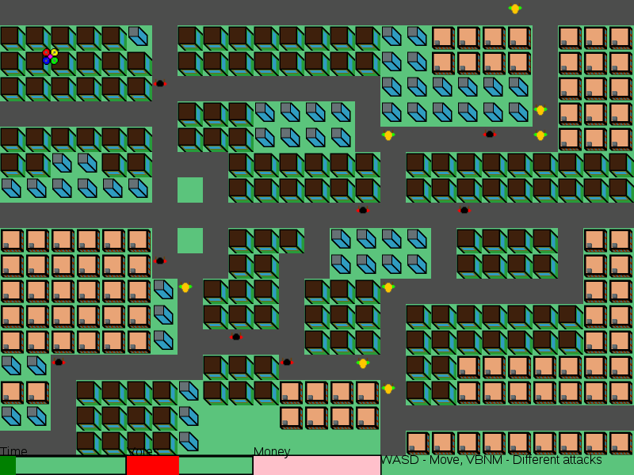
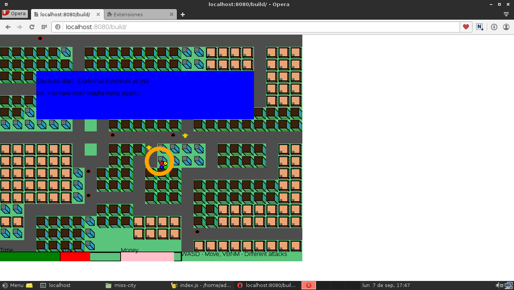
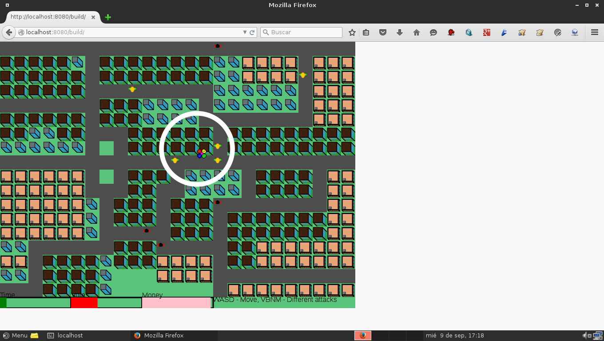

# MissCity

My entry for js13k 2015 game contest

# Build

```
npm install
gulp
cd build
http-server
```

# Resume

Objectives, controls, history, etc

> Look! It's Euralia. It's like the perfect city. Darío Paz is the perfect mayor... but not for us
> Our company, Encisa, is trying to build a super mall in an old house.
> The mayor however has promised that if he wins the elections, he will do a library
> We must stop it! You have a week (2 minutes) to win the elections. Use our dron!!

So, you must move the dron (use WASD on desktop, rotate the phone on mobile) to spread advertising in the city and convince people to vote you.
You win if: 
 * 51 people votes you
You lose if:
 * You waste all the money (spread advertising cost money)
 * Time pass (you have 2 minutes)
 
There are 4 different types of spreading advertising.

# Compatibility

Tested under: 

## Desktop

* Mozilla Firefox > 39
* Google Chrome > 42
* Opera > 31

## Mobile

* Mozilla Firefox for Android > 40

# Images






